[English](./README.en.md) | **简体中文**

<div align="center">


# WeightCanary

**盯守开源权重可用性的命令行工具：Hugging Face 快照、ModelScope/Gitee 镜像对比、可提交的审计账本**

[](https://github.com/SuperMarioYL/weightcanary/actions/workflows/ci.yml)
[](https://go.dev/)
[](https://github.com/SuperMarioYL/weightcanary/releases)
[](./LICENSE)

镜像：[Gitee](https://gitee.com/SuperMarioYL/weightcanary)

<p align="center"><picture><source media="(max-width: 640px) and (prefers-color-scheme: dark)" srcset="./assets/hero-mobile-dark.svg"><source media="(max-width: 640px)" srcset="./assets/hero-mobile-light.svg"><source media="(prefers-color-scheme: dark)" srcset="./assets/hero-dark.svg"></picture></p>

</div>

你 pin 在生产环境里的开源权重，可能在某个早上悄悄 404。WeightCanary 盯守 Hugging Face 上的模型可用性：权重是否还在、ModelScope/Gitee 镜像是否与源站分歧，并把每次 watch 的快照写进一份可提交的 `state.json`——git 历史就是审计账本。一条命令，一个静态二进制，没有账号，没有服务端。

## 为什么需要 WeightCanary

- **权重的可用性是政策决定，不是技术保证。** 六周前被公开承诺的 Muse Spark 权重，在 Spark 1.3 发布之后依然没有出现（截至 2026-09-21）。pin 在 requirements 或部署脚本里的模型 id，不会提前告诉你这些。
- **镜像层没有人盯。** 国内团队拉 DeepSeek / Qwen / GLM 的权重走 ModelScope 和 Gitee。这两个镜像层与 Hugging Face 之间的滞后和分歧是不可见的——镜像站为吞吐而生，不会主动公布自己的滞后，而"镜像比源站少了哪个文件"最终是你的事故。
- **事后救援不如事前告警。** 删库后的 torrent 备份解决的是"拿回来"；WeightCanary 解决的是"先知道"：文件清单、size、LFS sha256 每轮对比，谁动了、什么时候动的，翻 git 历史就有。

## 演示

以下是一次真实运行（2026-09-21，对三个默认模型现场抓取；完整记录与输出见 [docs/demo-results.json](docs/demo-results.json)）：

```bash
$ weightcanary init
wrote models.yaml with the default watchlist:

  deepseek-ai/DeepSeek-V3.1
  Qwen/Qwen3-235B-A22B
  zai-org/GLM-4.5            (ModelScope id: ZhipuAI/GLM-4.5)

$ weightcanary watch
weightcanary report — 3 model(s) — generated 2026-09-21T00:12:42Z

deepseek-ai/DeepSeek-V3.1
  huggingface  ok     177 files  641.3 GiB  commit c0781d0
  gitee        error  0 files    0 B        gitee: HTTP 403 … — rate limited; set GITEE_TOKEN
  modelscope   ok     178 files  641.3 GiB  divergent: 3 changed, +1 extra on mirror

Qwen/Qwen3-235B-A22B
  huggingface  ok     128 files  437.9 GiB  commit 8efa617
  modelscope   ok     129 files  437.9 GiB  divergent: 1 changed, +1 extra on mirror

zai-org/GLM-4.5
  huggingface  ok     101 files  667.5 GiB  commit cbb2c7c
  modelscope   ok     102 files  667.5 GiB  divergent: 1 changed, +1 extra on mirror
```

读法：DeepSeek-V3.1 的权重分片与 LFS sha256 在 HF 与 ModelScope 完全一致，实际漂移的是 `README` / `LICENSE` / `.gitattributes` 和一个镜像多出的 `configuration.json`（逐文件明细在 `--files` 输出里）。Gitee 行在匿名 API 限流时显式报错——工具不会把没查完的镜像说成"已同步"。

## 快速开始

```bash
# 1. 安装（约 30 秒）
go install github.com/SuperMarioYL/weightcanary@latest
# 或从 Releases 下载对应平台的压缩包（darwin/linux/windows × amd64/arm64）

# 2. 生成盯守清单（约 30 秒）
weightcanary init

# 3. 增删你要盯的模型（可选，约 60 秒）：编辑 models.yaml

# 4. 第一次快照 + 报告（约 60 秒）
weightcanary watch

# 5. 把清单和账本提交进 git——历史即审计账本
git add -f models.yaml && git add state.json
git commit -m "start watching model availability"
```

想定时盯守，把仓库自带的 [.github/workflows/watch.yml](.github/workflows/watch.yml) 一起提交即可：GitHub Actions 每 6 小时跑一次 `weightcanary watch` 并提交新的 `state.json`，无需任何服务端。

只盯一个模型试试水，可以用仓库自带的最小清单：

```bash
weightcanary watch --config examples/models.minimal.yaml
```

## 工作原理

<p align="center"><picture><source media="(max-width: 640px) and (prefers-color-scheme: dark)" srcset="./assets/architecture-mobile-dark.svg"><source media="(max-width: 640px)" srcset="./assets/architecture-mobile-light.svg"><source media="(prefers-color-scheme: dark)" srcset="./assets/architecture-dark.svg"></picture></p>

```
models.yaml ──► weightcanary（单进程静态二进制）
                ├── poller   HF Hub API / ModelScope API / Gitee API → 快照
                ├── report   终端可用性报告（--files 展开逐文件清单）
                ├── state    state.json（可提交的审计账本）
                ├── diff     逐轮对比与告警去重（m2，未实现）
                └── notify   飞书 / 钉钉 / Webhook（m2，未实现）
schedule: cron 或 .github/workflows/watch.yml — 无服务端、无数据库
```

每个 registry 一个只读 REST 接口，没有任何 SDK。对线上 API 实测后的真实行为：

- **Hugging Face**：`/api/models/{id}` 取 commit sha，`/tree/{sha}?recursive=true` 取逐文件 size 与 `lfs.oid`（sha256）。没有逐文件 mtime，所以新鲜度靠 size+sha256 对比上一轮快照。缺失或 gated 的仓库返回 HTTP 401（不是 404）——两者都按"不存在"处理。
- **ModelScope**：`/api/v1/models/{id}/repo/files?Recursive=true` 一次返回全部条目；LFS 权重的 `Sha256` 与 HF 的 `lfs.oid` 一致，可跨站对比。仓库不存在时返回 HTTP 200 + `Success=false`，不是 HTTP 错误。
- **Gitee**：`/git/trees/{ref}?recursive=1` 列出 blob，但 LFS 权重是 ~134 字节的指针文件——真实 size 和 sha256 要逐个小文件取回指针内容解码。匿名 API 限流严格，大仓库建议设置 `GITEE_TOKEN`；解码不完整的清单会被标记为 partial，报告里明确标注，不会冒充"已对比"。

## 能力与集成

<p align="center"><picture><source media="(max-width: 640px) and (prefers-color-scheme: dark)" srcset="./assets/integrations-mobile-dark.svg"><source media="(max-width: 640px)" srcset="./assets/integrations-mobile-light.svg"><source media="(prefers-color-scheme: dark)" srcset="./assets/integrations-dark.svg"></picture></p>

| 能力 | 状态 | 说明 |
| :--- | :--- | :--- |
| Hugging Face / ModelScope / Gitee 三站快照 | 已实现 | 逐文件 presence、size、LFS sha256；HF 带 commit sha |
| HF vs 镜像同步判定 | 已实现 | 文件集 + size + LFS sha256 对比，输出 in sync / divergent 明细 |
| `state.json` 审计账本 | 已实现 | 每轮快照落盘，提交进 git 后历史即可追溯 |
| 定时快照（GitHub Action / cron） | 已实现 | `watch.yml` 每 6 小时刷新并提交账本 |
| 下架 / 分歧告警（飞书、钉钉、Webhook） | m2 | 首轮为基线，之后一变更一告警；卡片 payload 需真实机器人验证 |
| `report --markdown` 与发布承诺台账 | m3 | "pledged 2026-08-10 — day N, no weights" 式的 README 台账 |

## 配置

`models.yaml`（由 `weightcanary init` 生成，模板见 [models.example.yaml](models.example.yaml)）：

```yaml
models:
  - id: deepseek-ai/DeepSeek-V3.1     # Hugging Face id，作为模型主键
    mirrors:                          # 各镜像站上的 id，缺一个就不盯那个站
      modelscope: deepseek-ai/DeepSeek-V3.1
      gitee: hf-models/DeepSeek-V3.1  # Gitee 上 "Hugging Face 模型镜像" 组织的同步仓库

  - id: zai-org/GLM-4.5
    mirrors:
      modelscope: ZhipuAI/GLM-4.5     # 注意：ModelScope 上 GLM-4.5 挂在 ZhipuAI 名下
      gitee: hf-models/GLM-4.5
```

环境变量：`HF_TOKEN`（读 gated 仓库）、`GITEE_TOKEN`（私有仓库与更高限流配额）。

命令行：`weightcanary watch -c models.yaml -s state.json [--files]`；`weightcanary report [-s state.json] [--files]`（`--markdown` 属于 m3，尚未实现）。

`state.json` 是普通 JSON：每个模型一条 `AvailabilityRecord`，HF 状态、各镜像状态、逐文件 size 与 LFS sha256、抓取时间。它就是账本本体——提交进 git，任何一次"它当时还在吗"都有答案。

## 付费

CLI 免费开源，本仓库的全部功能（快照、对比、账本、定时 Action）没有功能锁。WeightCanary 的商业路径是同源的**托管盯守服务**，随 v0.1 发布后上线：

| 方案 | 价格 | 包含 |
| :--- | :--- | :--- |
| 托管免费层 | ¥0 | 最多盯守 5 个模型，按计划自动刷新，飞书/钉钉告警 |
| 托管 Pro | ¥128/月（每 workspace） | 不限模型数、团队告警路由（飞书 / 钉钉 / Slack / Webhook）、私有账本与更长保留期 |

团队一旦在免费 CLI 上收到第一条真实告警，把 `models.yaml` 粘贴进托管页就能在 10 分钟内让整条流水线接管——不需要自己维护 Action 和密钥。托管服务上线前，这里的定价即是路线图承诺；本仓库不会以任何功能锁强迫升级。

## 路线图

- [x] **m1 — 快照与可用性报告**（当前）：三站 poller、`state.json` 账本、`watch` / `report`、定时刷新 Action。
- [ ] **m2 — 变更检测与告警**：逐轮 diff（下架、镜像分歧）、首轮基线、一变更一告警的去重，飞书 / 钉钉 / Webhook 卡片（payload 将在真实机器人上验证后发布）。
- [ ] **m3 — 承诺台账**：`pledges:` 配置（承诺日期、产物、来源链接）、"pledged — day N, no weights" 台账、`report --markdown` 输出 README 徽章与账本。
- [ ] **托管盯守服务**：免费层 ≤5 模型；Pro ¥128/月。见上文「付费」。

## 已知限制

- **Gitee 匿名限流**：大镜像（上百个权重分片）的逐文件指针解码可能耗尽匿名配额；此时清单标记为 partial 并在报告中明示，建议设置 `GITEE_TOKEN`。
- **ModelScope 无仓库级 commit sha**：镜像新鲜度靠文件集 + size + LFS sha256 判定（HF 行有 commit sha 可做门控）。
- **gated 仓库**：HF 对缺失或 gated 仓库都返回 401，统一按"不存在"报告；watch 自己的 gated 仓库请设置 `HF_TOKEN`。
- **网络位置**：HF API 直连 huggingface.co。hf-mirror.com 只镜像 `/resolve/` 下载路径，其 `/api/*` 行为随地区不同（本构建未验证），因此不能作为 API 层的降级通道。
- **只盯元数据，不搬运权重**：对比的是文件清单、size 与 LFS sha256，从不下载权重本体。
- **告警未上线**：m2 之前没有自动通知；本轮与上一轮的差异请用 git 对比 `state.json` 查看。

## License

<p align="center"><sub><a href="./LICENSE">MIT</a> © 2026 SuperMarioYL</sub></p>
